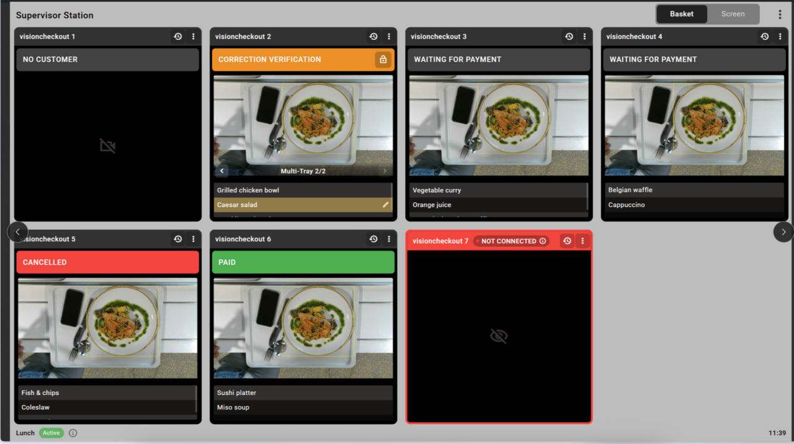
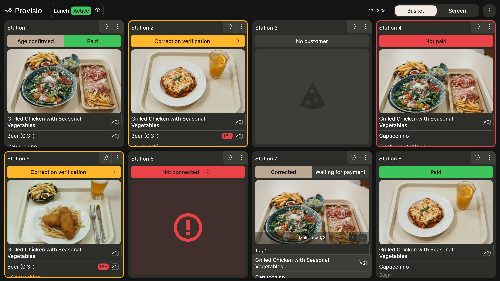
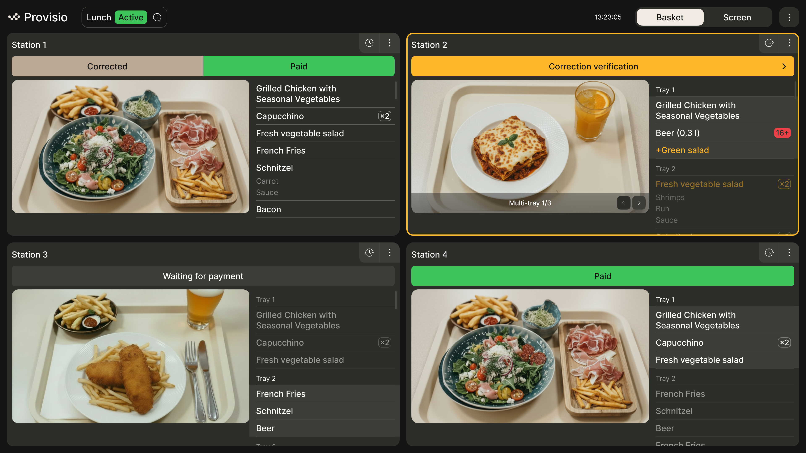
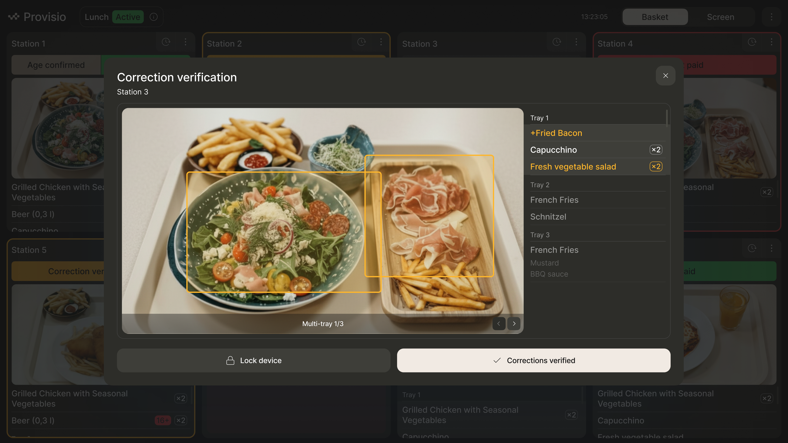

# ProVisio

Редизайн экранов наблюдения за работой станций самообслуживания. Такие станции работают в точках общественного питания. Они позволяют покупать обеды не обращаясь к кассиру, просто нужно отсканировать свой поднос с едой и система сама сформирует чек. 

За всеми станциями наблюдает ответственный работник. Работнику на экран выводятся live view записи, работник может смотреть, что происходит, корректировать если необходимо, изменять количество позиций, подтверждать возраст, если товар с ограничениями по возрасту и т.д.

Задача состоит в редизайне этих экранов так, чтобы они решали проблемы доступности для людей пожилого возраста, но при этом необходимо чтобы все экраны станций могли уместить на один экран и за ними можно было наблюдать одновременно.

Ограничение - возраст сотрудников и количество касс - от 1 до 8

До:

После:

